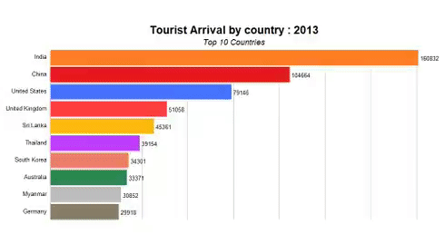

```{r setup, include=FALSE, message=FALSE, warning=FALSE, include=FALSE, cache=T}
knitr::opts_chunk$set(message = FALSE, warning = FALSE)
```


```{r include=FALSE}
source('scripts/library.R')
source('scripts/visualize.R')
source('scripts/country.R')
source('scripts/visitor.R')
source('scripts/mapping.R')
source('scripts/animator.R')
source('scripts/adventure.R')
```


Home 
=====================================

<!--  -->

<!-- Visitors -->
<!-- =====================================      -->

Row {data-width=150}
-----------------------------------------------------------------------

### Tourist Arrival 2018 {.value-box}

```{r}
articles <- tourist_arrival_average_length_stay$Number%>% tail(1)
valueBox(articles,color = "green", icon = "fa-note")
```

### Average Stay 2018 {.value-box}

```{r}
comments <- tourist_arrival_average_length_stay$`Average Length of Stay`%>% tail(1) 
valueBox(comments, icon = "fa-pencil")
```

### Visit Nepal 2020 Tourist Target {.value-box}

```{r}
valueBox("2 Million", icon = "fa-dot-circle", color = "red")
```


### Visit Nepal 2020 Average Stay {.value-box}

```{r}

valueBox("14 Days", icon = "fa-bullseye",color = "orange")
```

 Column {.tabset .tabset-fade data-width=700 .colored }
-----------------------------------------------------------------------
   
<!-- ### Chart 0 {.no-padding} -->

<!-- ```{r} -->
<!-- tourist_arrival_average_length_stay <- read_excel("data/tourist_arrival_average_length_stay.xlsx") -->
<!-- ``` -->


<!-- ```{r} -->
<!-- hchart(tourist_arrival_average_length_stay,"spline", hcaes(x = Year,y = Number),name = "Number of Tourist") -->

<!-- ``` -->

    
### Tourist Arrival {.no-padding}

```{r}
page_38_tourist_arrival_nationality_month <- read_excel("data/page_38_tourist_arrival_nationality_month.xlsx")
```

```{r}
ggplotly(num_tourist)%>% config(displayModeBar = F)
```


    
### Tourist Arrival By Gender {.no-padding}

```{r}
ggplotly(tourist_arrival_sex_chart)%>% config(displayModeBar = F)
```


    
### Tourist Arrival By Age {.no-padding}

```{r}
ggplotly(visitor_age_chart)%>% config(displayModeBar = F)
```
   
### Tourist Average Stay {.no-padding}

```{r}

ggplotly(ave_tourist_stay)%>% config(displayModeBar = F)
```   


Country 
=====================================     
   
Row {data-height=600}
-------------------------------------

### Tourist By Country

```{r}

tourist_by_country_chart
```


   
### Tourist By Country Animation


    

<!-- NewPage1 {data-navmenu="Region" data-icon="fa-list"} -->
<!-- =====================================      -->


<!-- Row {data-height=600} -->
<!-- ------------------------------------- -->

Purpose of Visit
=======

Row {.tabset .tabset-fade}
-------------------------------------


### Pilgrimage 

```{r}
plot_pilgrimage_purpose  
```

### Business

```{r}
plot_business_purpose
```

### Trekking

```{r}
plot_trekking_purpose

```

<!-- Row {.tabset .tabset-fade} -->
<!-- ------------------------------------- -->


<!-- ### Official -->

<!-- ```{r} -->
<!-- plot_official_purpose -->
<!-- ``` -->

<!-- ### Conference -->

<!-- ```{r} -->
<!-- plot_conv_conf_purpose -->
<!-- ``` -->

<!-- ### Chart 6 -->

<!-- ```{r} -->
<!-- plot_others_purpose -->
<!-- ``` -->


Economic Context
=====================================     
   
Row {data-height=600}
-------------------------------------

### Foreign Exchange Earrnings (NRS)

```{r}

ggplotly(GROSS_FOREIGN_EXCHANGE_EARNINGS_FROM_TOURISM_NRS_chart) %>% config(displayModeBar = F)
```


### Gross Foreign Exchange Earnings (USD)

```{r}
ggplotly(GROSS_FOREIGN_EXCHANGE_EARNINGS_FROM_TOURISM_US_chart) %>% config(displayModeBar = F)

```

   
### Gross Domestic Production

```{r}
ggplotly(gdp_chart) %>% config(displayModeBar = F)
```   

Adventure
=====================================     

Column 
-------------------------------------
    
### Registered Houses & Beds 2018
    
```{r}
create_map(df_address = "data/reg_homestay_nepal_2018.csv", column1 = "affiliated_house_2018", column2 = "affiliated_bed_2018")
```

Column 
-------------------------------------
   
### Top National Park


```{r}
National_park_df_chart
```   
 
### Top Trekking Route
    
```{r}
trek_df_chart
```


About {data-icon="fa-info-circle"}
========================


Column 
-------------------------------------

### Visit Nepal 2020:

<center>

Thanks for visiting this dashboard


https://visitnepal2020.com/

References:

The team behind the project is [DataSansar](https://www.facebook.com/datasansar) :

 [Diwash Shrestha](https://twitter.com/diwastha)

[Binod Jung Bogati](https://twitter.com/bjungbogati)

[Prakriti Dhungana](https://twitter.com/prakriti50)

The data used in this dashboard can be found at:

http://tourism.gov.np/

This project was created in [Nepal Solvathon 2019](https://dataliteracy.github.io/solveathon/) supported by World Bank, UK AID, The Asia Foundation.


<<<<<<< HEAD:index.Rmd

=======

>>>>>>> c77b78f7c3e81c299b2a06ef7c6dad530eed0f8e:index.Rmd
